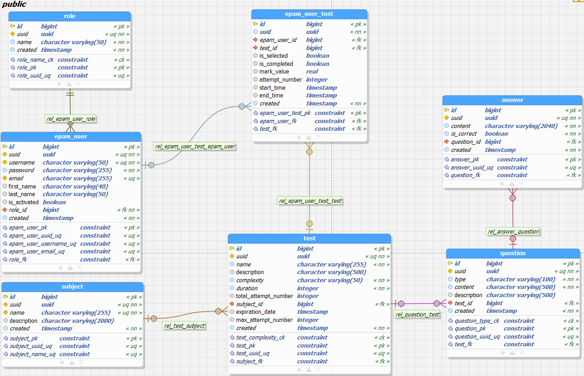

# Examination System

The final project of the Java Summer 2022 Training Program, EPAM Systems

## Project assignment

The student registers in the system and after registration can pass one or more Tests. There is a list of tests in the
system.

**For the list it is necessary to implement:**

* choice of tests on a particular subject;
* sorting tests by name;
* sorting tests by difficulty;
* sorting tests by number of queries.

The student chooses the test and passes it. A certain period of time is allocated for passing the test, which is set
for each test separately. The student has a personal account, which displays registration information, as well as a
list of passed tests with the results.

**The system administrator:**

* creates, deletes or edits tests;
* blocks, unblocks, edits the users.

**When creating a test, the administrator:**

* sets the test time;
* sets the complexity of the test;
* adds Questions to the test.

A question can have one or more correct answers. The result of the test is the percentage of questions that the
student answered correctly in relation to the total number of questions (it is considered that the student answered
the question correctly if his answer coincides exactly with the correct answers).

> Additionally !!!

For the application's purpose were developed the custom dependency injection framework. 
It allows us to create a fully connected tree with all dependencies that object of specified class needed, and use them further.

## Requirements

| Name          | Version  |
|:--------------|:---------|
| Java          | 17       |
| PostgreSQL    | 14.1     |
| Apache Tomcat | 10.0.27  |

## Launching

1. Firstly, create and populate the epam_examination_system database. You can do this using 2 variants:
    * Restore the database from the epam_examination_system.backup file that was located in the root directory.
    * Manually, create and populate the epam_examination_system database
      using [schema.sql](https://github.com/rliubymenko/epam-examination-system/blob/master/core_examination_system/src/main/resources/db/schema.sql)
      and [init.sql](https://github.com/rliubymenko/epam-examination-system/blob/master/core_examination_system/src/main/resources/db/init.sql)
2. Compile and package the application to the .war file.
3. Deploy the resulting .war file putting them in the Apache Tomcat webapps directory.

## Usage

The application will be accessible on [the following path](http://localhost:8080/examination-system)

## Database schema diagram

